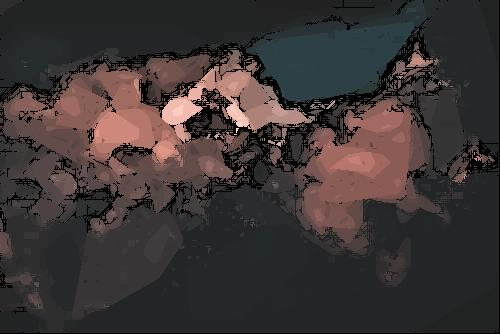

# Beyond K-Means: A Novel, Dynamic, and Geometry-Aware Clustering Algorithm

This project introduces a **completely new clustering algorithm** designed to overcome the limitations of conventional clustering methods like K-Means and DBSCAN. It works without any prior assumption of the number of clusters, avoids arbitrary distance thresholds, and operates directly on real image data in HSV color space.

## 🚀 What This Algorithm Does

Rather than relying on centroid-based grouping or density estimation, this method clusters image pixels based on **perceptual color similarity (in HSV)** combined with **spatial connectivity**, ensuring that visually coherent and spatially localized regions are correctly segmented.

### ✅ Key Features

- **No predefined number of clusters required**
- **Color-based clustering** using perceptually meaningful HSV space
- **Connected component analysis** to avoid grouping disconnected but similar regions
- **Convex Hull boundary detection** using a custom Gift Wrapping algorithm
- **Geometric projection** to generate novel 2D "shadow planes" for advanced applications (e.g., depth estimation, frame interpolation)
- **Noise handling and edge fill** for producing clean, artifact-free images

---

## 🧠 Why This Is Different

Unlike traditional clustering techniques:
- No k-value is required.
- No dependency on Euclidean distance metrics.
- No reliance on density parameters (like epsilon in DBSCAN).
- It **constructs cluster boundaries geometrically** using Convex Hulls, offering higher fidelity control over region shapes.

This approach makes it more suitable for **real-world image segmentation**, **motion interpolation**, **3D approximation**, and **light-modeling simulations**.
---


## 🔬 Applications

This clustering algorithm is a **base component** for multiple research-level use cases:

- **Frame interpolation** (Cluster-aware morphing)
- **Image-based depth approximation**
- **Autonomous scene segmentation**
- **Data compression**
- **Medical scan preprocessing**
- **Satellite image simplification**

---

## 📸 Example Output

Following is the image for you to see the cluster bifercation happening . The Final resized image ( with noise being added for smooth trastitions) is in the main directory . The following image is generated by the code after analysing the input image . This is the resized version of that input image (without noise being added).



---

## 🛠️ Tech Stack

- **Python 3.10+**
- `Pillow` for image manipulation
- `NumPy` and `SciPy` for geometry and computation
- `scikit-image` for connected component labeling
- `matplotlib` (optional) for visualization

---

## 📦 Installation

1. Clone the repository:

2. Install dependencies:
   ```bash
   pip install -r requirements.txt
   ```

---

## ▶️ Usage

Run the full clustering and shadow-plane generation pipeline:

```bash
python main.py
```

Input image is expected at:  
`images/input_image_to_be_analysed.jpg`  
Output images will directory come in the main directory where the main.py file is located

---


## ⚠️ Disclaimer

This is **not a production-ready package** but a proof-of-concept research project. It is still being refined and extended for more robust and generalized use cases.

---

## 📫 Contact

Built by **Daksh Arora**  
📧 daksharoraofficial@gmail.com  
🔗 [LinkedIn](https://www.linkedin.com/in/daksh-arora-851263256) | [GitHub](https://github.com/DakshArora31415926535)
